# CTFlearn: Forensics

### Taking LS (+10 points)
Скачиваем архив и открываем его. Внутри находится папка "The Flag", в которой лежат следующие файлы:

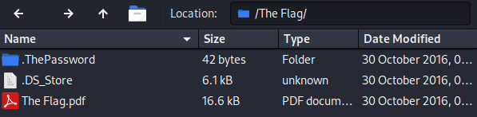

В папке ".ThePassword" лежит пароль от PDF-файла:

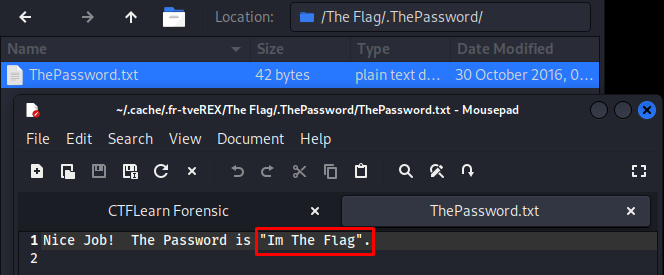

Открываем PDF при помощи найденного пароля:

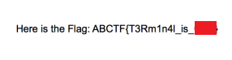

### Rubber Duck (+10 points)
Утилита **file** способна показывать комментарий файла:

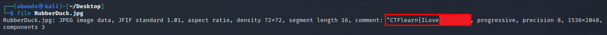

### I'm a dump (+10 points)
Для начала проверим файл при помощи утилиты **file**:

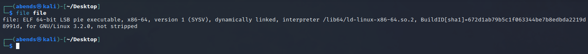

Видим, что это исполняемый файл - естественно не запускаем его. Смотрим его через **strings**:

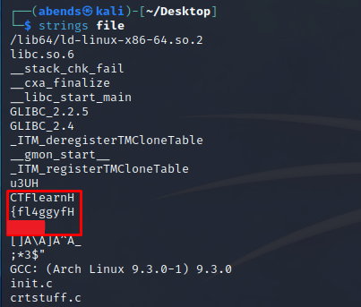

> Note: Из флага надо убрать лишние буквы H

### WOW.... So Meta (+20 points)
Флаг находится в разделе "Camera Serial Number". Просмотр осуществляется при помощи улититы **exiftool**:

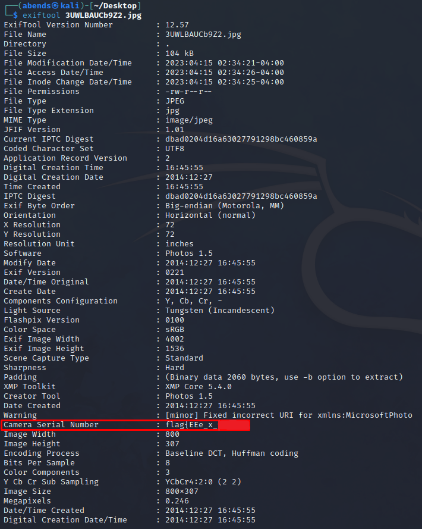

### Exif (+20 points)
Флаг находится в разделе "Owner Name". Просмотр осуществляется при помощи улититы **exiftool**:

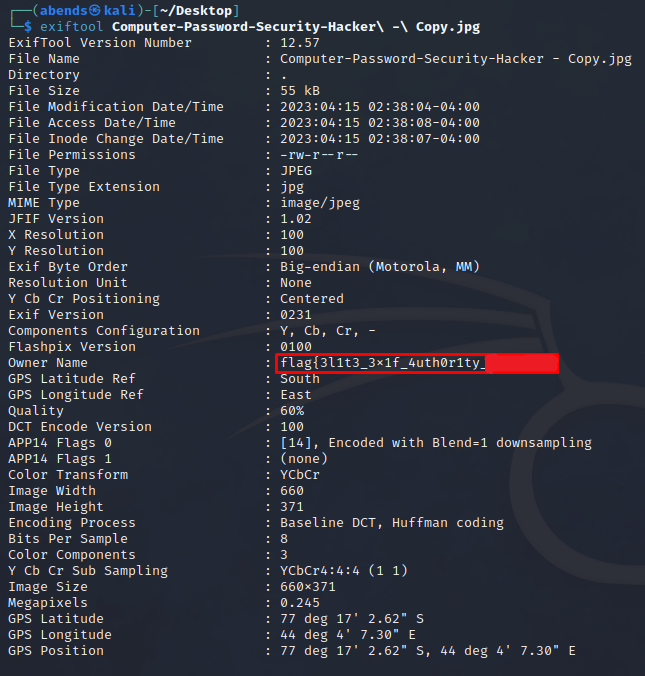

### Snowboard (+20 points)
Смотрим файл через **strings**:

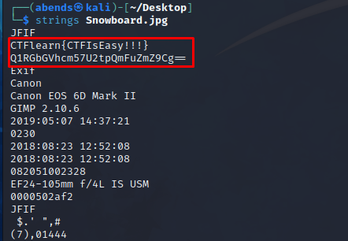

Первый флаг - обман. Под ним что-то закодированное в base64, судя по '=='. Декодируем:

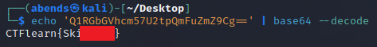

### PikesPeak (+20 points)
Тут на внимательность (формат флага):

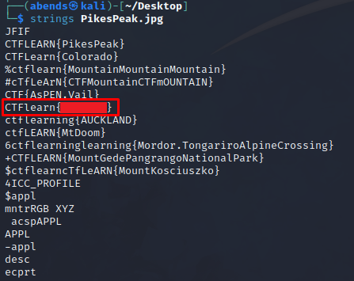

### Tux! (+20 points)
Через **exiftool** находим закодированный комментарий. Сразу его декодируем:

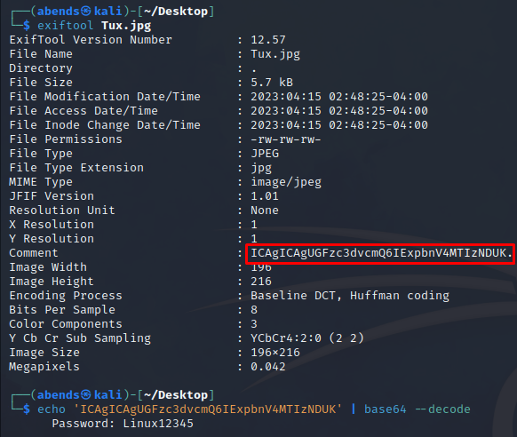

С помощью **binwalk** пытаем извлечь спрятанные данные:

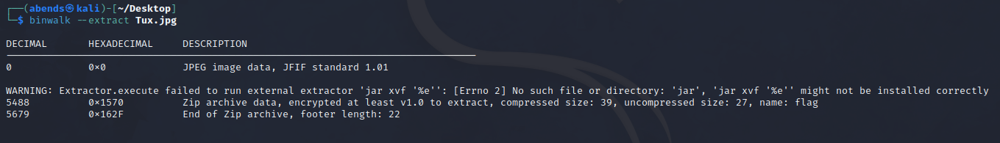

Открываем найденный архив. Внутри файл *flag*, который пустой. Архив защищен паролем, но пароль мы уже нашли:

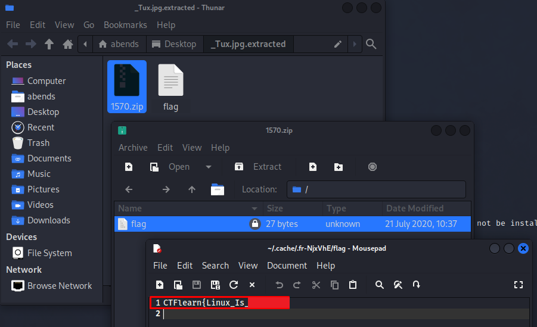

