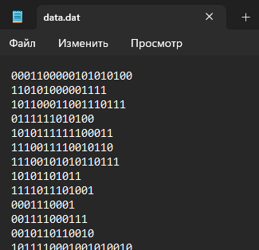
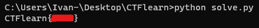
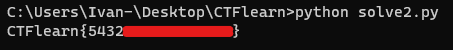

# CTFlearn: Programming

### Simple Programming (+30 points)

Нам дан файл, в котором находится множество строк, содержащих 0 и 1:



# Задача состоит в том, чтобы найти количество строк в файле, где количество 0 кратно 3 или количество 1 кратно 2

```python
# Открываем файл для чтения данных
with open("data.dat", "r", encoding="UTF-8") as file_data:

	# Сначала читаем первую строку из файла
	data = file_data.readline()

	# Здесь хранится значение количества строк, которые подходят нам по одному из условий задачи
	result = 0

	# Далее переходим в цикл, где уже файл будет читаться целиком,
	# засчет повторения "file_data.readline()" 
	while data:
		# Как только программа считала строку с файла, она считает в ней количество 0 и 1
		count_0s = data.count('0')  
		count_1s = data.count('1')

		# Читаем новую строку из файла при каждой итерации цикла
		data = file_data.readline()

		# Проверка на условия задачи 
		if count_0s % 3 == 0 or count_1s % 2 == 0:
			result += 1
	
	# Выводим полученный результат в формате флага
	print("CTFlearn" + "{" + f"{result}" + "}")
```



---

### The Credit Card Fraudster (+20 points)

Суть задачи состоит в том, чтобы восстановить номер карты через алгоритм Луна. 

Алгоритм Луна - алгоритм вычисления контрольной цифры номера пластиковой карты в соответствии со стандартом ISO/IEC 7812. Не является криптографическим средством, а предназначен в первую очередь для выявления ошибок, вызванных непреднамеренным искажением данных

Суть алгоритма:
1. Начиная с первой цифры последовательности слева и через одну цифру (то есть позиции 1, 3, 5, 7, 9, …) в случае, если количество цифр в последовательности нечетное (как в этом примере, где оно равно 15, 16-я — контрольная), если же количество цифр четное, тогда, начиная со второй цифры последовательности через одну цифру (то есть позиции 2, 4, 6, 8, …), делается проверка: если 2·x > 9, то из произведения вычитается 9, иначе произведение 2·x оставляем без изменения, где x — текущая цифра, например,

```sh
4  5  6  1     2  6  1  2     1  2  3  4     5  4  6  4
8     12       4     2        2     6        10    12
8     3        4     2        2     6        1     3
```

2. Затем все числа, полученные на предыдущем этапе, складываются.

```sh
8+5+3+1 + 4+6+2+2 + 2+2+6+4 + 1+4+3+4 = 57
```

3. Полученная сумма должна быть кратна 10 (то есть равна 40, 50, 60, 70, …). В примере выше исходная последовательность некорректна. В примере: последняя цифра — контрольная. Для того, чтобы номер был верен в соответствии с алгоритмом Луна, контрольная цифра должна быть равна 7.

```sh
4  5  6  1     2  6  1  2     1  2  3  4     5  4  6  7
8     12       4     2        2     6        10    12
8     3        4     2        2     6        1     3
8+5+3+1 + 4+6+2+2 + 2+2+6+4 + 1+4+3+7 = 60
```

Решение задачи:

```python
# Введем переменные для известных частей карт
card_num_part_1 = "543210"
card_num_part_3 = "1234"


def luhn_checksum(card_number):
	card_number = list(map(int, list(card_number)))

	checksum = 0

	for i in range(len(card_number)):
		if i % 2 == 0:
			if card_number[i] * 2 > 9:
				checksum += card_number[i] * 2 - 9
			else:
				checksum += card_number[i] * 2
		else:
			checksum += card_number[i]

	if checksum % 10 == 0:
		return True
	else:
		return False


for i in range(999999):
	card = card_num_part_1 + (str(i).zfill(6)) + card_num_part_3
	if int(card) % 123457 == 0:
		if luhn_checksum(card_number=card):
			print("CTFlearn{" + f"{card}" + "}")
```



---

