# KPK CTF Platform

---

## Task 1: Photo.zip (misc)

Имеем архив, внутри которого находится jpg-файл с названием image2. 


Решение: 

Нажимаем по файлу правой кнопкой мыши, затем «показать содержимое»:


Видим текстовый файл с названием flag.txt. Открываем его:

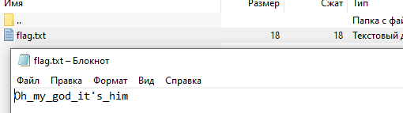

Флаг: **Oh\_my\_god\_it's\_him**

---

## Task 2: task.rar (crypto)

Смотрим в архив и видим, что дан py-файл и файл с расширением .tutututu:


Разархивируем и смотрим дальше:


Видим, что работаем с UTF-16 (сигнализаторами являются \xff\xfe), плюсом к этому идет работа с base64. Попробуем пойти от обратного:

Для начала, скопируем исходную строку из файла со странным расширением: 

```sh
b'\xff\xfeS\x00i\x00B\x00N\x00U\x00F\x00d\x00G\x00I\x00E\x00R\x00Q\x00U\x00E\x00x\x00K\x00R\x00l\x00Q\x00=\x00'
```

Изменим UTF-16 и получим: **b'SiBNUFdGIERQUExKRlQ='**

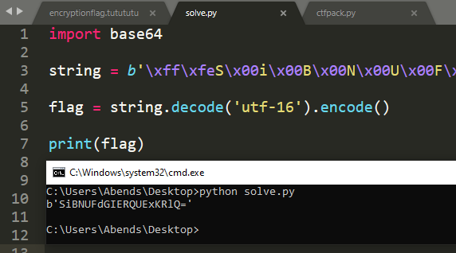

Теперь разберемся с base64, получаем: **J MPWF DPPLJFT**


Теперь разбираемся с алгоритмом в исходном скрипте:


Все, что делает скрипт выше - всего лишь передвигает букву флага на одну позицию вперед. Сделаем обратное, будем перемещать на одну позицию назад:


Результат:


Флаг: **I LOVE COOKIES**

---

## Task 3: Can\_you\_run\_me (misc)

Имеем какой-то непонятный файл без явного расширения, если смотреть через Windows. Тогда запустим Linux и посмотрим, что скажет он:


Собственно, уже что-то. Тип файла – executable (двоичный исполняемый файл). Пока искал, что это такое, набрел на следующую таблицу:

|Linux extension|Windows Equivalent|Short description|
| :-: | :-: | :-: |
|[none], .elf(rare),|.exe, .com(rare)|Binary executables|
|.so, .o|.dll|Shared libraries|
|.a|.lib|Static library, for linking into an executable|
|[none], .sh|.bat|Shell script|
|[none], .pl, .php, .py, etc|.cmd, .vbs|Other scripting languages which may be used|
|.exe|.exe|Linux may be configured to execute some Windows executables using mono or wine|
|.deb, .rpm, etc|.msi|Installer package for the various distributions. Note that the packages in Linux distributions are more powerful as it supports dependency management and more.|
|.tar.gz, .tar, .gz, .zip, .lzo, .lz4|.zip|Archives that can contain a program or any other files, and may be compressed|
|.ko|.sys|Drivers and kernel modules are loaded into the Linux kernel and have more hardware access than other programs.|

Это, конечно, прекрасно, но давайте откроем файл:

1. Open the terminal
1. Track the file with executable (application/x-executable) using cd command
1. Use the command: chmod +x file\_name or chmod a+x file\_name
1. Now type ./file\_name, note that you might also need sudo mode

chmod – команда для изменения прав доступа к файлам и каталогам. X – вид права, означающий выполнение.


Флаг: **\_You|are\_the|best\_ctf’er:)**

---

## Task 4: ctf.exe (reverse)

Ну раз .exe, тогда попробуем запустить:

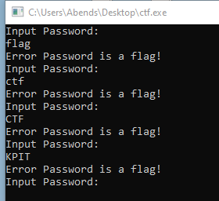

По сути, программа выполняем проверку пароля, вот только пароль-то нам и нужен. Угадывать его бесполезно, поэтому открываем IDA PRO:

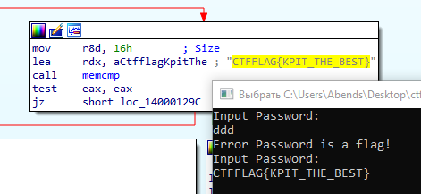

В одном из разделов видна переменная с названием **aCtfflagKpitThe**, а также по всей видимости записан флаг)

Флаг: **CTFFLAG{KPIT\_THE\_BEST}**

---

## Task 5: Notes (crypto)

Нам дана шифрограмма в виде нот. Гуглим – music decoder: https://www.dcode.fr/music-sheet-cipher

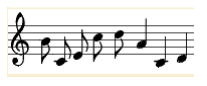


Флаг: **GACHITOP**

---

## Task 6: 2strings (crypto)

Даны две строки и подсказка к ним:

1) MHhkMjllZDMzNzE5ODkzMDIxYWE3OThiYTIyOWRiOTNiOGI4N2QzMDdkMzRjN2Zk
2) MHhiNGYyYjI1MDYyY2E2NDY3ZjU0OGY4ZmQ0N2FlZmVkYThiNDg2ZjRkNWFmNDgw

Подсказка находится в фразе: answer is ^? 

А если точнее, знак ^, который означает операцию XOR. Оператор XOR может производить операции как с бинарными, так и hex, decimal значениями.

Воспользуемся сайтом: https://www.dcode.fr

На этом сайте включаем определитель шифра и в качестве входных данных заносим одну из наших строк:


Далее после анализа двух строк я столкнулся с проблемой, которая заключалась в том, что шифр распознается не совсем правильно. На рисунке выше видно, что определитель говорит о шифре Виженера, но на самом деле это не так.

Введем обе строки вместе и посмотрим на результат:


Шифр определяется как Base, вот только это не Base62, а Base64, соответственно, открываем данный раздел и в качестве входных данных вносим обе строки.


Получаем следующее:

```sh
0xd29ed33719893021aa798ba229db93b8b87d307d34c7fd0xb4f2b25062ca6467f548f8fd47aefeda8b486f4d5af480
```

Данную строку разбиваем на две, находя hex-заголовки (0х) в этой строке.

```sh
0xd29ed33719893021aa798ba229db93b8b87d307d34c7fd 0xb4f2b25062ca6467f548f8fd47aefeda8b486f4d5af480
```

Поле этого, применяем операцию XOR к полученным строкам, используя для этого сайт: https://xor.pw


Флаг: **flag{CTF\_1s\_numb35\_0n3}**

---

## Task 7: generalSkills (misc)

Сначала я подумал, что это какая-то разновидность штрих-кода, но нет. На разборе некоторых других тасков, был хинт на этот таск:


Собственно, сам код:


Если вкратце, то мы открываем изображение, получаем его размеры, затем в массив pixel\_values помещаем значения цветов пикселей (метод getdata() возвращает содержимое этого изображения в виде объекта последовательности, содержащего значения пикселей). Если вывести pixel\_values, то получим rgb-значения:


Полученные rgb-значения заменяем 0 и 1 – эта операция представлена в цикле. На выходе получаем новый массив new с "0" и "1":


Эти "0" и "1" объединяем в одну строку str\_new:

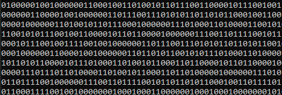

После этого, идет выполнение функции decode\_binary\_string(), которая производит перевод из bin в UTF-8:


Флаг: **flag{50m3\_c0d1ng\_t45k5}**

---

## Task 8: Калейдоскоп (joy)

Нам даны две картинки, на которых есть черные фигуры и нет фона. Для того, чтобы решить задание, сначала совмещаем две прозрачные картинки на белом фоне и получаем следующее:


Полученная строка: 66 6C 61 67 7B 57 30 77 5F 31 74 5F 77 34 73 5F 61 77 35 30 6D 33 7D

Далее эту hex-строку переводим в формат UTF-8: https://www.rapidtables.com/convert/number/hex-to-ascii.html


Флаг: **flag{W0w\_1t\_w4s\_aw50m3}**

---

## Task 9: Web1 (web)

Заходим по ссылке на сайт и видим следующее:

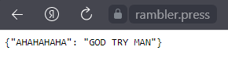

Задание решается через отправку HTTP-запроса на сервер. Данную операцию удобно проделать с помощью утилиты curl.

Небольшая справка - HTTP-сообщения: запросы и ответы

Данные между клиентом и сервером в рамках работы протокола передаются с помощью HTTP-сообщений. Они бывают двух видов:

**Запросы (HTTP Requests)** — сообщения, которые отправляются клиентом на сервер, чтобы вызвать выполнение некоторых действий. Зачастую для получения доступа к определенному ресурсу. Основой запроса является HTTP-заголовок.

**Ответы (HTTP Responses)** — сообщения, которые сервер отправляет в ответ на клиентский запрос.

Так вот основной задаче был подбор параметра –X, т.е. правильного метода.

Перечень методов: GET, POST, HEAD, PUT, DELETE, OPTIONS, PATCH.

Решение:


Флаг: **flag{I\_wanna\_be\_a\_bird!}**

---

## Task 10: Arduino (arduino)

Дан архив, в котором находится код программы к микроконтроллеру, а также схема сборки макета.


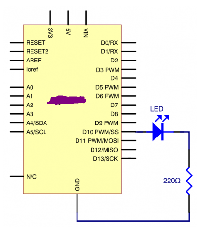

Также к заданию был предоставлен ресурс, с помощью которого можно проектировать собственные схемы, а также программировать микроконтроллеры в них.

Ресурс: https://www.tinkercad.com/learn/circuits

Для начала мной была собрана схема:

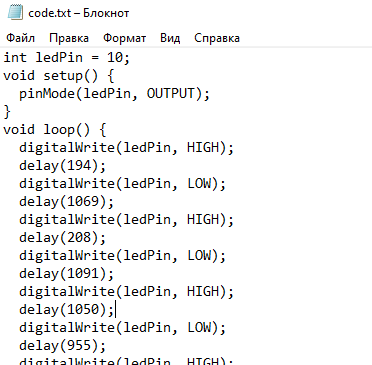

Мультиметр поставил в качестве эксперимента, он никакой роли здесь не играет.

Далее занес код из файла в специальный раздел:


Далее запустил моделирование и увидел, что светодиод мигает либо быстро, либо медленно, а иногда присутствуют и паузы. Значит, это скорее всего Азбука Морзе. Разность во времени миганий задается при помощи функции delay().

Быстрые мигания представлены «.»

Медленные мигания представлены «-»

Проанализировав мигания, получаем: 

```sh
..-. .-.. .- --. .... . .-.. .--. -- .
```

Что эквивалентно записи FLAGHELPME.

Флаг: **FLAG{HELPME}**

---

## Task 11: Arduino 2 (arduino)

Дан архив, в котором находится код программы к микроконтроллеру, а также схема сборки макета.


Для начала была собрана схема и перенесен код в Tinkercad:


В задании было сказано, что флагом является последовательность символов «r», «g», «b», соответственно, включаем моделирование схемы и записываем последовательность загорания светодиодов.

Флаг: **flag{ggrrbb grbrrgg grb}**

---

## Task 12: Arduino 3 (arduino)

Дан архив, в котором находится код программы к микроконтроллеру, а также схема сборки макета.


Далее собираем схему и переносим код программы:


После сборки включаем режим симуляции и смотрим за происходящим. Флагом является последовательность символов, показанных на 7-сегментном экране.

Флаг: **flag{lol\_you\_did\_it}**

---

## Task 13: CryptoGarry (crypto)

Дано:

```sh
«Я попросил Гарри написать рецепт, вот что я получил в сообщении: 
114г коры дуба, 47г корня мандрагоры {измельченной), 24мл сока алихоция. Кипятить 39 минут, после чего добавить 78г борщевика, 8 настояться, добавить 6г белены, 8г жаборослей, 8г дьявольских силиков, 3мл сока ложечницы, поварить еще 90 минут, после чего по вкусу добавить 53г листов визгопрека и 7г соли. (на следующий день можно кушать}»
```

Хинт – «chemistry». Это навело на мысль про таблицу Менделеева, где прописаны коды и названия элементов. Выписываем из текста все числа: `114 47 24 39 78 8 6 8 8 3 90 53 7`

Находим названия элементов по номерам в таблице:


При этом, необходимо учитывать регистр букв в названии элемента, поэтому флаг:

Флаг: **FlAg{CrYPtOCOOLiThIN}**

---

## Task 14: CryptoBase32 (crypto)

Дана следующая последовательность символов:

```sh
MZWGCZ33MRXW45DGN5ZGOZLUMFRG65LUIJAVGRJTGJ6Q==-==
```

Если посмотреть сразу в base64, то флага мы не получим, следовательно, смотрим внимательно на запись и замечаем, что в конце какие-то странные символы после двух первых знаков равно.

Скорее всего, два знака равно останутся, тогда выясняем, какая еще кодировка может иметь два равно на конце. Попробуем Base32:

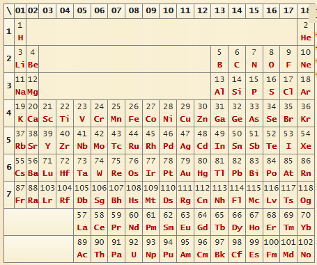

Флаг: **flag{dontforgetaboutBASE32}**

---

## Task 15: WebMaster (web)

Перейдем по ссылке и увидим форму логин/пароль. Попробуем войти в систему с ником «user» и паролем «asd»:

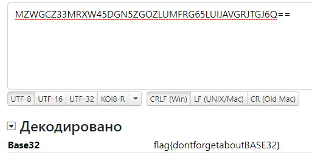

При нажатии на «Вход» происходит редирект на другую страницу, где видно, что создан новый аккаунт:


Посмотрим на код страницы, а именно на js-скрипт:


Суть этого скрипта в том, что функция me(), принимающая в качестве параметра login, возвращает результат POST-запроса, где находятся данные об аккаунте.


Для теста получим значение переменной login. В результате получим наш текущий login, но в этом поле стоит текущий id. На скрине выше видно, что id это login.


Попробуем передать в функцию me() наш id:

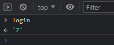

В итоге получим наши данные при входе в систему:

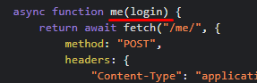

По логике, админ регистрировался раньше всех, поэтому ищем флаг в первых логинах.


Флаг: **flag{sqli\_master}**

---

## Task 16: Web (web)

При открытии ссылки появляется следующее сообщение:


Гуглим, как в запросе поменять user-agent и находим шаблон команды: curl -A "<custom\_user\_agent>" <url>

Введем команду в CMD:

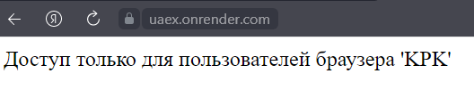

Флаг: **flag{kpk\_best0fTheBest}**

---

## Task 17: Восстановление файла (forensic)

В самом начале имеем битый файл, в котором должен находиться флаг. Откроем этот файл в notepad++ в hex-формате.

Начальная часть

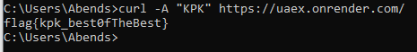

Нижняя часть


Структура файла напоминает структуру PNG-файла:


Еще немного теории в схеме:


Пример из GitHub:


Поэтапно анализируем файл:


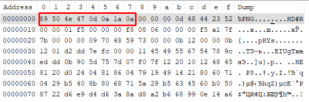

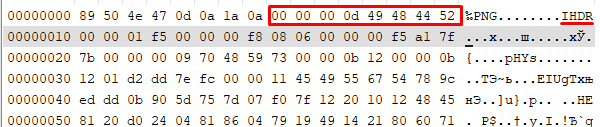

После всех изменений сохраняем файл:


Флаг: **flag{H3aderl3ss\_h0rs3man}**

---

## Task 18: Библиотека (OSINT)

Описание задания: в одной библиотеке, существовавшей еще тогда, когда все люди говорили на одном языке, уже было все, что может написать человек. Флаг к этому таску там тоже был. Единственная проблема в том, что в таком количестве информации сложно что-то найти. Хорошо, что у нас есть карта! (К флагу нужно добавить обертку flag{}).


Хинт - почитайте что такое Library of Babel

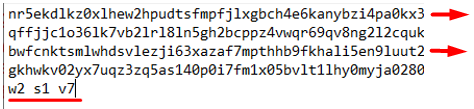

Ссылка на ресурс: https://libraryofbabel.info/

Переходим во вкладку «Browse» и копируем в поле «Hex Name» данный нам текст:


Далее, следуя указаниям, выбираем наши параметры w, s, v:


В итоге открывается текст и в заголовке flag!


Флаг: **flag{theflaghasalwaysbeenhere}**

---

## Task 19: DogsName (OSINT)

Описание: Назовите "породу" китайской собаки, которая бегает в стенах РТУ МИРЭА. Формат флага: flag{DogsName}. 

На самом деле задание является простым в том случае, если знаешь, что твоем учебном заведении есть такого рода штуки. Я же знал, что есть такая собака, поэтому решение получилось быстрым.

Для начала просто попробуем загуглить:


А в итоге находим имя собаки по самой первой ссылке!)


Флаг: **flag{AlienGo}**

---

## Task 20: MireaMountain (OSINT)

Описание: Какого размера гора на востоке РТУ МИРЭА? формат: flag{width\_height}

Таск опять же простой, если ты знаешь, что происходит в других кампусах РТУ МИРЭА, я же знал, видимо, только про китайскую собаку, поэтому решение было крайне долгим.

В итоге имеем, аж целых два хинта:

- гора – метафора, искать нужно возле уника, когда поймете про какую гору речь, найти ответ будет очень просто
- тхт 

ТХТ – Институт Тонких Химических Технологий, к нему и направляемся:


Далее движемся влево и видим скалодром:


После этого снова гуглим и находим информацию про данный скалодром:


Флаг: **flag{12\_15}**

---

## Task 21: Blue Line (stegano)

Переходим по ссылке и скачиваем файл result.png, в котором при открытии не обнаруживаем ничего особенного. Размер картинки составляет 26х1 пикселей. Что-то похожее уже было в перовом General Skills. Соответственно, если не знаешь, что делать с картинкой – просканируй пиксели. 


В результате выполнения кода представлен набор rgb-значений для каждого пикселя.


Далее было не очень понятно, пробовал различные конверторы, но результата не было. Поэтому ждал до хинта: «Работать нужно с одним из rgb-значений»

Достаточно долго пробуя работать с последними значениями, был получен очередной хинт: «Английский алфавит»

И вот оно никак, но потом открыл-таки алфавит…


И вот тут осенило! А что, если попробовать вычитать из 255 каждое полученное значение? В итоге – сработало:


Флаг: **flag{iwillbethekingofthepirates}**

---

## Task 22: Разминка nc (crypto)

Дано: nc 194.135.20.5 10001

Выполняем эту команду:


Попробуем передать строку, которую от нас хотят в неизменном виде:


Не получилось. В таком случае, декодируем биты в текст и получаем «basilisk». Вставим это слово:


Далее интереснее – ASCII Code – получаем «kingisher». Введем:


В третьем случае, очевидно, hex. Декодируем и получаем следующую строку – «wolverine»:

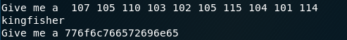

Флаг: f**lag{f3w\_w4y5\_t0\_c0n3rt\_5ting5}**

---
