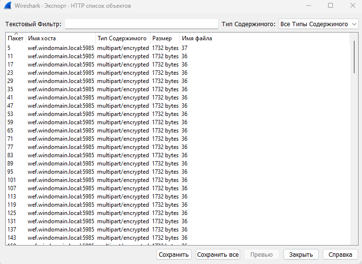

# PicoCTF (PicoCym) Forensics

---

## Task 1: Wireshark doo dooo do doo... (50 points)

Description:

> Can you find the flag? **shark1.pcapng**

Открываем файл и сразу замечаем при пролистывании множество HTTP-объектов:

Просматриванием список HTTP-объектов через "Экспорт объектов" в Wireshark:

Среди всего однообразия находим пакет под номером 827:

Смотрим более детально данный пакет

Находим нечто похожее на флаг. Расшифруем:

Флаг: picoCTF{p33kab00_1_s33_u_deadbeef}

---
