# PicoCTF (PicoGym) - Web

---

## Task 1: Cookies

Description:

> Who doesn't love cookies? Try to figure out the best one. <http://mercury.picoctf.net:54219/>

Переходим по ссылке и обращаем внимание на поле ввода данных:


Введем «snickerdoodle» и получим следующее:


Посмотри на cookie в инспекторе:


Меняем значения поля «Value» на 1 и перезагружаем страницу:

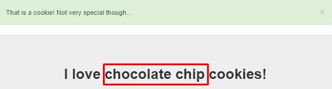

Таким образом меняем значение от 0 до 18, а на 18 получаем флаг:

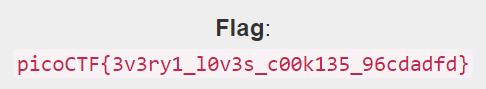

Флаг: picoCTF{3v3ry1_l0v3s_c00k135_96cdadfd}

---

## Task 2: Scavenger Hunt

Description:

> There is some interesting information hidden around this site <http://mercury.picoctf.net:5080/>. Can you find it?

Перейдем по ссылке:


Смотрим в инспектор:


Нашли первую часть флага, ищем далее:


В файле myjs.js встречаем следующее сообщение:

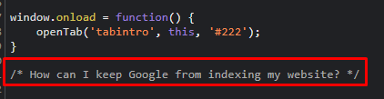

На сайте Google находим следующую информацию: Google предлагает бесплатный набор инструментов Search Console, который помогает владельцам сайтов повышать эффективность сканирования своего контента. Им также доступны традиционные инструменты, например, файлы Sitemap и robots.txt. С их помощью можно задать частоту сканирования контента или вообще исключить его из индекса Google Поиска.

Попробуем поменять myjs.js на robots.txt в адресе страницы:


Если это Apache, то попробуем найти файл с расширением .htaccess. Меняем полностью robots.txt на .htaccess:


«Store» намекает нам о том, что используется .DS\_Store. Меняем .htaccess на .DS\_Store:


Флаг: picoCTF{th4ts_4_l0t_0f_pl4c3s_2_lO0k_35844447}

---

## Task 3: where are the robots

Description:

> Can you find the robots? <http://jupiter.challenges.picoctf.org:56830> 

Перейдем по ссылке и увидим следующую страницу:


Robots.txt — это текстовый файл, который содержит параметры индексирования сайта для роботов поисковых систем. Пример:


Добавим к ссылке /robots.txt:


Теперь попробуем заменить /robots.txt на /1bb4c.html:


Флаг: picoCTF{ca1cu1at1ng_Mach1n3s_1bb4c}

---

## Task 4: logon

Description:

> The factory is hiding things from all of its users. Can you login as Joe and find what they've been looking at? <https://jupiter.challenges.picoctf.org/problem/44573/> 

Заходим на сайт:


Пробуем войти при помощи username «Joe» и password «admin»:


Применим какой-нибудь другой логин и пароль:


Мы вошли, но не можем получить флаг, плюс к этому получается, что проверка идет именно по «Joe», остальные пользователи не проверяются. Просмотрим в инспектор (cookie):

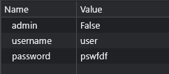

Меняем значение «False» на «True» в поле admin и обновляем страницу:

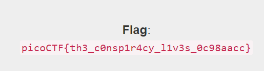

Флаг: picoCTF{th3_c0nsp1r4cy_l1v3s_0c98aacc}

---

## Task 5: don’t use client-side

Description:

> Can you break into this super secure portal? <https://jupiter.challenges.picoctf.org/problem/17682/> 

Смотрим сайт:


При попытке ввода любого пароля выдает ошибку, в таком случае заглянем в инспектор:


Находим валидатор, в котором все предельно просто – флаг разбит на несколько последовательностей. Эти последовательности соединяем в правильном порядке, ориентируясь на числа, на которые умножается значение переменной split.

Флаг: picoCTF{no_clients_plz_b706c5}

---

## Task 6: login

Description:

> My dog-sitter's brother made this website but I can't get in; can you help? <https://login.mars.picoctf.net/> 

Переходим по ссылке:


Смотрим через инспектор, что у нас происходит при входе:

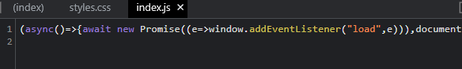

Внимательно изучаем строку, которая находится выше и замечаем две интересные закодированные строки:

```js
(async()=>{await new Promise((e=>window.addEventListener("load",e))),document.querySelector("form").addEventListener("submit",(e=>{e.preventDefault();const r={u:"input[name=username]",p:"input[name=password]"},t={};for(const e in r)t[e]=btoa(document.querySelector(r[e]).value).replace(/=/g,"");return"YWRtaW4"!==t.u?alert("Incorrect Username"):"cGljb0NURns1M3J2M3JfNTNydjNyXzUzcnYzcl81M3J2M3JfNTNydjNyfQ"!==t.p?alert("Incorrect Password"):void alert(`Correct Password! Your flag is ${atob(t.p)}.`)}))})();
```

Своего рода валидация, вот только похоже мы нашли исходные логин и пароль, с которыми сравниваются наши значения. Декодируем из base64 и получаем: login=admin, password= picoCTF{53rv3r_53rv3r_53rv3r_53rv3r_53rv3r}, в итоге валидация при вводе этих значений проходит успешно.

Флаг: picoCTF{53rv3r_53rv3r_53rv3r_53rv3r_53rv3r}

---

## Task 7: local Authority

Description:

> Can you get the flag? Go to this website and see what you can discover. <http://saturn.picoctf.net:49699/> 


В инспекторе ничего не найдено интересного, тогда попробуем что-нибудь ввести в поля, но получаем «Log IN Failed», но при этом появились новые файлы в инспекторе: login.php и secure.js. Смотрим на js-файл: 


Вот и логин с паролем, пытаемся войти с этими данными:


Флаг: picoCTF{j5_15_7r4n5p4r3n7_05df90c8}

---

## Task 8: pico browser

Description:

> This website can be rendered only by picobrowser, go and catch the flag! <http://jupiter.challenges.picoctf.org:28921> 

Входим на сайт, нажимаем на кнопку «Flag», но получаем следующее:


Сменим User-Agent через запрос в curl: 


В ответ на запрос получаем то, за чем пришли:


Флаг: picoCTF{p1c0_s3cr3t_ag3nt_84f9c865}

---

## Task 9: Client-Side-Again

Description:

> Can you break into this super secure portal? <http://jupiter.challenges.picoctf.org:60786> 

Сайт:


При вводе данных – ошибка, поэтому смотрим исходники ресурса. Находим в основном файле следующую строку:

```js
var _0x5a46=['f49bf}','_again_e','this','Password\x20Verified','Incorrect\x20password','getElementById','value','substring','picoCTF{','not_this'];(function(_0x4bd822,_0x2bd6f7){var _0xb4bdb3=function(_0x1d68f6){while(--_0x1d68f6){_0x4bd822['push'](_0x4bd822['shift']());}};_0xb4bdb3(++_0x2bd6f7);}(_0x5a46,0x1b3));var _0x4b5b=function(_0x2d8f05,_0x4b81bb){_0x2d8f05=_0x2d8f05-0x0;var _0x4d74cb=_0x5a46[_0x2d8f05];return _0x4d74cb;};function verify(){checkpass=document[_0x4b5b('0x0')]('pass')[_0x4b5b('0x1')];split=0x4;if(checkpass[_0x4b5b('0x2')](0x0,split*0x2)==_0x4b5b('0x3')){if(checkpass[_0x4b5b('0x2')](0x7,0x9)=='{n'){if(checkpass[_0x4b5b('0x2')](split*0x2,split*0x2*0x2)==_0x4b5b('0x4')){if(checkpass[_0x4b5b('0x2')](0x3,0x6)=='oCT'){if(checkpass[_0x4b5b('0x2')](split*0x3*0x2,split*0x4*0x2)==_0x4b5b('0x5')){if(checkpass['substring'](0x6,0xb)=='F{not'){if(checkpass[_0x4b5b('0x2')](split*0x2*0x2,split*0x3*0x2)==_0x4b5b('0x6')){if(checkpass[_0x4b5b('0x2')](0xc,0x10)==_0x4b5b('0x7')){alert(_0x4b5b('0x8'));}}}}}}}}else{alert(_0x4b5b('0x9'));}}
```

Собираем флаг: picoCTF{not_this_again_ef49bf}

---

## Task 10: CaaS

Description:

Now presenting cowsay as a service: <https://caas.mars.picoctf.net/> 

Сайт:

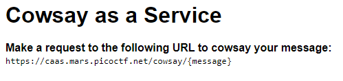

Нам нужно что-то ввести в фигурных скобках при копировании ссылки, пробуем:

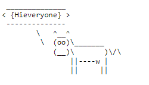

Корова повторяет фразу, введенную в скобках. Попробуем ввод на SSTI: 


или

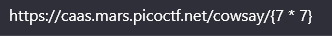


Подробнее: https://github.com/carlospolop/hacktricks/blob/master/pentesting-web/ssti-server-side-template-injection/README.md

Видим, что сработало, пробуем дальше:

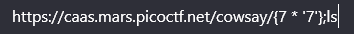

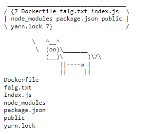

Читаем флаг:

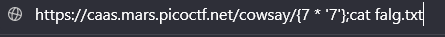

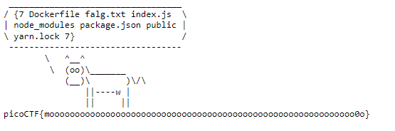

Флаг: picoCTF{moooooooooooooooooooooooooooooooooooooooooooooooooooooooooooo0o}

---

