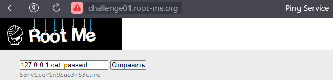
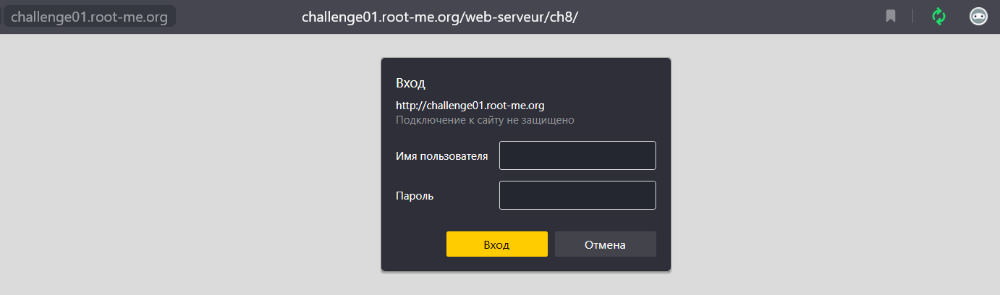

# Root-Me Challenges: Web - Server

---

## Task 1: HTML - Source code (5 points)

Переходим на сайт:


Нам нужен пароль для входа, который мы не знаем, но находим его в исходном коде страницы


---

## Task 2: Weak password (10 points)

Переходим на страницу с таском, где нам предлагают пройти аутентификацию, чтобы попасть на страницу. Применяем базовые логин/пароль (admin:admin) для входа и попадаем на страницу:


Можно было сделать и через **hydra** (hydra -L userList.txt -P passwordsList.txt 212.129.38.224 http-head /web-serveur/ch3/), а также другие инструменты.

---

## Task 3: PHP - Command Injection (10 points)

Переходим по предоставленной ссылке:


Сервис предоставляет возможность проверки доступности какого-нибудь ресурса через утилиту ping - нужно ввести в поле ввода только адрес. Но что будет, если ввести IP-адрес и через `;` ввести вторую команду?


Как видим, вторая команда также исполняется. Получим исходный код файла **index.php** в base64 и декодируем его:


```html
<html>
<head>
<title>Ping Service</title>
</head>
<body>
<form method="POST" action="index.php">
        <input type="text" name="ip" placeholder="127.0.0.1">
        <input type="submit">
</form>
<pre>
<?php 
$flag = "".file_get_contents(".passwd")."";
if(isset($_POST["ip"]) && !empty($_POST["ip"])){
        $response = shell_exec("timeout -k 5 5 bash -c 'ping -c 3 ".$_POST["ip"]."'");
        echo $response;
}
?>
</pre>
</body>
</html>
```

Узнаем, что флаг находится в `.passwd` и достаем его:



Можно было решить и по-другому:


---

## Task 4: HTTP - Directory indexing (15 points)

При переходе на сайт перед нами красуется пустая страница:


Заглядываем в исходный код и находим **/admin/pass.html**:


```sh
http://challenge01.root-me.org/web-serveur/ch4/admin/pass.html
```

Переходим по найденном пути:


Очередная наеб**. Поднимемся выше:

```sh
http://challenge01.root-me.org/web-serveur/ch4/admin/
```

Находим еще одну директорию **/backup**:


Внутри нее находится файл **admin.txt**, где расположен ответ на таск:

```sh
http://challenge01.root-me.org/web-serveur/ch4/admin/backup/admin.txt
```


---

Task 5: HTTP - User-agent (10 points)

При переходе на сайт нам сообщают о том, что мы используем неправильный **User-Agent**:


При помощи утилиты **curl** и параметра **-A** можно легко поменять требуемый параметр:


Ответ успешно получен

---

Task 6: HTTP - IP restriction bypass (10 points)

От нас требуется авторизоваться на сайте относительно локального IP-адреса. Гуглим HTTP-заголовки, который могут манипулировать IP-адресами:


Опытным путем узнаем, что нам необходим заголовок **X-Forwarded-For**:

```sh
C:\Users\Ivan->curl -H "X-Forwarded-For:127.0.0.1" http://challenge01.root-me.org/web-serveur/ch68/
<!DOCTYPE html>
<html>
<head>
        <title>Secured Intranet</title>
</head>
<body><link rel='stylesheet' property='stylesheet' id='s' type='text/css' href='/template/s.css' media='all' /><iframe id='iframe' src='https://www.root-me.org/?page=externe_header'></iframe>
                        <span>Your IP <strong>127.0.0.1</strong> do not belong to the LAN.</span>
                <h1>Intranet</h1>
                <form method="post">
                        <p>
                                <label for="login">Login:</label>
                                <input type="text" name="login">
                        </p>
                        <p>
                                <label for="pass">Password:</label>
                                <input type="text" name="mdp">
                        </p>
                        <p>
                                <input type="submit" value="login">
                        </p>
                        <p>
                                <small>You should authenticate because you're not on the LAN.</small>
                        </p>
                </form>
        </body>
</html>
```

Как видим, IP изменился, что видно в ответе от сервера. Далее вспоминаем (или смотрим стандарт RFC 1918) диапазоны локальных IP-адресов. Первое, что приходит на ум 192.168.0.0/16

```sh
RFC 1918

10.0.0.0        -   10.255.255.255  (10/8 prefix)
172.16.0.0      -   172.31.255.255  (172.16/12 prefix)
192.168.0.0     -   192.168.255.255 (192.168/16 prefix)
```

Пробуем подставить IP-адрес из вышеупонянутого диапазона:


---

Task 7: HTTP - Open redirect (10 points)

При переходе на страницу видим три кнопки, которые под собой скрывают ссылки на указанные ресурсы:


Сами ссылки можно посмотреть через исходный код страницы:


Например, разберем редирект на facebook:

```html
<a href="?url=https://facebook.com&h=a023cfbf5f1c39bdf8407f28b60cd134">facebook</a>
```

Здесь мы видим, что в параметр **url** передается сама ссылка на ресурс, а также у нас есть и второй параметр **h**, который является хэшем, а хэш (формат MD5) представляет собой все ту же самую ссылку:


Формируем новую ссылку (редирект на google.com):

```sh
http://challenge01.root-me.org/web-serveur/ch52/?url=https://google.com&h=99999ebcfdb78df077ad2727fd00969f
```

И переходим по ней. Ловим флаг)


---

Task 8: Backup file (15 points)

Переходим на сайт и видим перед собой форму авторизации:


Как мы уже выяснили, исходная страница - **index.php**. Тогда остается узнать расширение, которое обозначает backup. Сайт: **https://kb.iu.edu/d/affo**

Применяем:

```sh
http://challenge01.root-me.org/web-serveur/ch11/index.php~
```

Скачался файл! Открываем его:


Собственно, применяем искомые логин и пароль:


---

Task 9: HTTP - Headers (15 points)

При переходе на сайт нас просят обратить внимание на то, что ответ от сервера имеет не только содержимое:


Смотрим, какие заголовки нам приходят от сервера при нашем запросе:


Находим **Header-RootMe-Admin: none**. Отправляем запрос с данным заголовком в значении **true**:


В итоге нам приходит ответ с паролем

---

Task 10: HTTP - POST (15 points)

В очередной раз переходим на сайт и видим перед собой некую игру, где необходимо выбить число >999999:


Посмотрим, в чем же состоит подвох:


Основной проблемой тут является малый множитель. Изменим его прямо в исходном коде - припишем немного нулей:


А теперь, нажмем на **Give a try!**:


Вот мы и выиграли!

---

Task 11: HTTP - Improper redirect (15 points)

В PHP код http_redirect() или header('Location: ...') не выполняет остановку выполнения кода. В результате вместе со статусом 301 или 302 клиенту отправляется полное содержимое HTML страницы. Для захвата содержимого можно использовать различные инструменты, например, Burp Suite или curl.

Переходим на сайт:


В таске сказано, что необходимо найти страницу **index** (Get access to index.). Посмотрим, существует ли страница index.php. Чтобы это проверить, необходимо вместо `/login.php?redirect` подставить `/index.php`:


Как видим, **302 Found**, значит, страница существует. Попробуем получить содержимое через curl - там редирект страбатывать не будет:


Собственно, страницу мы перехватили и получили ответ

---

Task 12: HTTP - Verb tampering (15 points)

Уязвимость HTTP Verb Tampering – ошибка настройки контроля доступа для методов протокола HTTP. Тупо аутентификация включена не для всех разрешённых на web-сервере HTTP методов.

При переходе на страницу система просит пройти авторизацию:



При обычном переходе на страницу, мы по факту реализуем параметр GET:


Здесь стоит пароль, но если сменить HTTP-метод:


Вот мы и получили доступ к странице, используя другой HTTP-метод.

Некоторые HTTP-методы:

1. GET — используется для получения информации от сервера по заданному URI.
2. HEAD — тот же GET, но сервер посылает только заголовки и статусную строку без тела HTTP сообщения.
3. POST — используется для отправки данных на сервер.
4. PUT — используется для загрузки содержимого запроса на заданный URI.
5. DELETE — удаляет указанный в URI ресурс.
6. CONNECT — преобразует существующее соединение в тоннель.
7. OPTIONS — используется для получения параметров текущего HTTP соединения.
8. TRACE — создает петлю, благодаря которой клиент может увидеть, что происходит с сообщением на всех узлах передачи.

Бывают и другие, например: PATCH, PROPFIND, PROPPATCH, MKCOL, COPY, MOVE, LOCK, UNLOCK, SEARCH, POLL, NOTIFY и прочие.

---

Task 13: Install files (15 points)

В таске говорится о некой **phpBB** - `https://github.com/phpbb/phpbb`. Также упоминается **установка**. Постепенно находим данный путь, например, при помощи фаззера, где и лежит флаг:

```sh
http://challenge01.root-me.org/web-serveur/ch6/phpbb/install/install.php
```


---

Task 14: 

---
