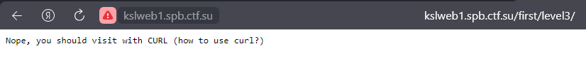

# Forkbomb (SPbCTF) - Web Kids 2.0

---

## Базовые приемы веба - level 1

В самом первом задании при простом переходе на сайт сразу появляется флаг:

Флаг: KSL{fc813aadb96c4a00b6887f73cee4efde}

---

## Базовые приемы веба - level 2

Во втором таске нам прелагают посмотреть на исходный HTML-код страницы:

Собственно, проверяем:

Флаг: KSL{4dc7b79ae6f3c46c904970ff7cdcecda}

---

## Базовые приемы веба - level 3

В третьем таске нам предлагают использовать CURL для получения страницы:

Используем:

Флаг: KSL{1cd1426c8929600867035e44edf22329}

---

## Базовые приемы веба - level 4

Здесь нам необходимо отправить два поля с необходимыми значениями:

---
